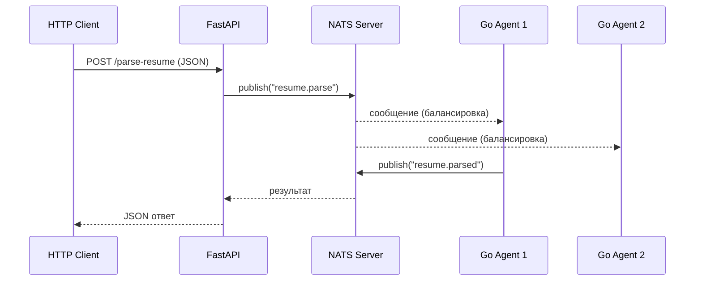

# Архитектура HR System

## Описание компонентов

**NATS Server** — брокер сообщений. Принимает сообщения от оркестратора и доставляет их агентам. Работает в Docker на порту 4222.

**Go Agent (resume_parser)** — агент обработки резюме. Подписывается на тему `resume.parse`, получает JSON с резюме, определяет уровень кандидата (junior/middle/senior) и публикует результат в `resume.parsed`. Может работать в нескольких экземплярах одновременно — NATS балансирует нагрузку между ними через queue groups.

**Python Orchestrator** — управляющий компонент. Отправляет задачи агентам, ожидает результаты с таймаутом 5 секунд, при сбое повторяет отправку до 3 раз.

**FastAPI** — REST API. Принимает HTTP запросы от клиентов, передаёт задачи оркестратору и возвращает результат.

## Диаграмма взаимодействия



## Топики NATS

| Топик | Кто публикует | Кто подписан |
|---|---|---|
| `resume.parse` | Оркестратор, FastAPI | Go агенты (queue group) |
| `resume.parsed` | Go агенты | Оркестратор, FastAPI |

## Запуск системы

```bash
# Запуск всех сервисов
docker-compose up --build

# Запуск агента локально
go run main.go

# Запуск оркестратора локально
python orchestrator/orchestrator.py

# Запуск API локально
uvicorn api.main:app --reload
```